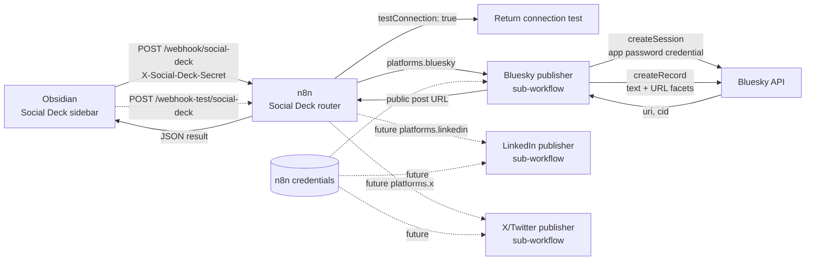

<div align="center">

# Obsidian Social Deck

Compose in Obsidian. Publish through n8n. 

[](#current-status)
[](https://obsidian.md/)
[](https://n8n.io/)
[](https://bsky.app/)
[](#licence)

[Overview](#overview) ·
[Setup](#connect-obsidian-to-n8n) ·
[n8n workflow](n8n/README.md) ·
[Development builds](docs/installing-development-builds.md) ·
[Security](SECURITY.md)

</div>

## Overview

Social Deck is an Obsidian plugin for composing, previewing, scheduling and publishing social media posts through a self-hosted n8n workflow.

## Table of contents

- [Planned platforms](#planned-platforms)
- [Architecture](#architecture)
- [Current status](#current-status)
- [Bluesky credentials](#bluesky-credentials)
- [Connect Obsidian to n8n](#connect-obsidian-to-n8n)
- [Development](#development)
- [Security](#security)
- [Licence](#licence)

## Planned platforms

- Bluesky (in progress)
- LinkedIn personal profiles and organisation pages
- X/Twitter

## Architecture



### Requirements
1. Obsidian
2. An n8n instance, im using a self hosted instance.

Social Deck provides an Obsidian sidebar composer for text posts. The plugin
sends approved posts to an authenticated n8n webhook. n8n stores platform
credentials and handles scheduling, retries and publishing.

## Current status

The sidebar includes a composer where you can paste post text directly and
publish. Platform enablement lives in plugin settings, and character counts live
in the sidebar.

Text-only Bluesky publishing is available from the plugin today. The recommended
n8n setup uses a Social Deck router workflow that calls a Bluesky publisher
sub-workflow. The Bluesky sub-workflow publishes text posts and creates URL link
facets. 

X and LinkedIn plugin publishing, images, link preview cards and threads
are not implemented yet.

## Bluesky credentials

The text-posting workflow does not require a Bluesky developer account, API key or client secret. It uses:

- Your full Bluesky handle, such as `example.bsky.social` or a custom-domain handle.
- A dedicated Bluesky app password.

Do not use your primary Bluesky account password.

### Create an app password

1. Sign in to [Bluesky](https://bsky.app/) in a web browser.
2. Open the direct [App Passwords](https://bsky.app/settings/app-passwords) page.
3. If using the settings menu, look under **Settings → Privacy and Security → App Passwords**. Some Bluesky versions place it under **Settings → Advanced → App Passwords**.
4. Select **Add App Password**.
5. Give it a recognisable name, such as `Social Deck n8n`.
6. Leave direct-message access disabled. Social Deck does not need it.
7. Create the password and copy it immediately. Bluesky displays an app password only once.
8. Store it in your password manager until n8n is configured.

If the password is lost or exposed, delete it from the same App Passwords page and create a replacement. Revoking this password does not change the primary account password.

### Add the credentials to n8n

Import [`n8n/workflows/bluesky-publisher-subworkflow.json`](n8n/workflows/bluesky-publisher-subworkflow.json)
and [`n8n/workflows/social-deck-router.json`](n8n/workflows/social-deck-router.json).
In n8n, create an **HTTP Request → Custom Auth** credential named
`Bluesky app password` with this JSON:

```json
{
  "body": {
    "identifier": "example.bsky.social",
    "password": "xxxx-xxxx-xxxx-xxxx"
  }
}
```

Open the imported **Create Bluesky session** node and select that credential. Do
not place the handle or app password in Obsidian settings, Markdown notes or this
repository.

Follow the remaining webhook-security instructions in the [n8n setup guide](n8n/README.md).

The current self-hosted workflow uses an app password for a single account. 

## Connect Obsidian to n8n

After importing and configuring the n8n workflow:

1. In n8n, create a **Header Auth** credential for the **Social Deck webhook**
   node.
2. Set the header name to `X-Social-Deck-Secret`.
3. Set the credential value to a long random secret, for example
   `replace-with-a-long-random-value`.
4. Save and activate the workflow.
5. Copy the production webhook URL from the **Social Deck webhook** node. It
   normally ends with `/webhook/social-deck`.
6. In Obsidian, open **Settings → Community plugins → Social Deck**.
7. Paste the production URL into **n8n webhook URL**.
8. If testing from n8n's **Listening for test event** screen, paste the test URL
   ending in `/webhook-test/social-deck` into **n8n test webhook URL**.
9. In **n8n webhook secret**, create or select an Obsidian SecretStorage entry
   containing the same random secret.
10. Select **Test connection** to confirm Obsidian can reach n8n before
   publishing.

Use the production webhook URL, not the test URL. n8n only accepts production
webhook requests while the workflow is active.

The **Test connection** button uses **n8n test webhook URL** when it is set, and
falls back to **n8n webhook URL** when it is blank. Publishing always uses
**n8n webhook URL**.

Social Deck stores the webhook URL and selected secret ID in Obsidian plugin
data. The webhook secret value is stored through Obsidian SecretStorage rather
than in `data.json`.

To create a random secret in PowerShell:

```powershell
[Convert]::ToBase64String((1..32 | ForEach-Object { Get-Random -Maximum 256 }))
```

To create one on Linux or macOS:

```bash
openssl rand -base64 32
```

## Development

Requirements:

- Node.js 20 or newer
- npm
- Obsidian 1.11.4 or newer

Install dependencies and create a production build:

```bash
npm install
npm run build
```

For local testing, copy or link `main.js`, `manifest.json` and `styles.css` into:

```text
<vault>/.obsidian/plugins/social-deck/
```

Reload Obsidian, enable **Social Deck** under Community plugins, then select **Open Social Deck** from the command palette or the raven ribbon icon.

### Development builds

Every successful GitHub Actions build on `main` produces an installable `social-deck.zip` artifact. See [Installing a development build](docs/installing-development-builds.md) for Windows and Obsidian instructions.

Tags matching `v*` also create a GitHub release containing the installable ZIP.

### Continuing development with Codex

See the [Codex project hand-off](docs/CODEX_HANDOFF.md) for the implemented architecture, current limitations, security constraints and recommended next work.

## Security

Do not place social-platform API credentials in the Obsidian vault. See [SECURITY.md](SECURITY.md) for the credential boundary.

## Licence

MIT
