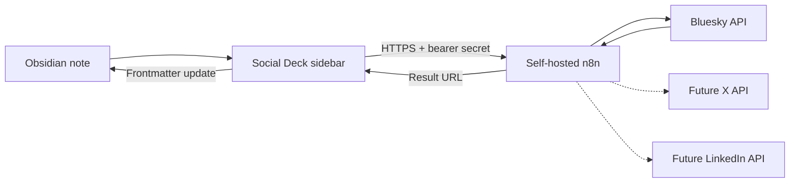

# Codex project hand-off

Last updated: 23 July 2026  
Repository: `torin-cyber-group/obsidian-social-deck`  
Current plugin version: `0.1.0`

## Project purpose

Social Deck is an Obsidian plugin for preparing social posts in Markdown and publishing them to selected platforms through a self-hosted n8n instance.

The intended experience is similar to a small social-media deck inside Obsidian:

- An Obsidian note is the source of truth.
- The sidebar shows a separate editable preview for each enabled platform.
- Each platform can be enabled or disabled per note.
- Platform character limits are checked before publishing.
- n8n holds social-platform credentials and performs external API calls.
- Publication status and public post URLs are written back to the note.

The planned platforms are Bluesky, X and LinkedIn. Only text-only Bluesky publishing is currently implemented.

## Decisions already made

- Keep social-platform credentials out of Obsidian and the vault.
- Store Bluesky credentials in the self-hosted n8n environment.
- Store only the n8n webhook URL and its bearer secret in the plugin settings.
- Use a custom raven icon for the Obsidian ribbon and Social Deck view.
- Let each note select its target platforms using `social-platforms` frontmatter.
- Treat n8n as the publication boundary. It will eventually own scheduling, retries and platform-specific API handling.
- Start with direct, text-only Bluesky publishing before adding images, threads, scheduling or other platforms.
- Defer X integration until an acceptable API-access option is chosen.

## What works now

### Obsidian plugin

- Opens Social Deck from the raven ribbon icon or the **Open Social Deck** command.
- Reads the active Markdown note and removes its YAML frontmatter from the post preview.
- Parses `social-*` frontmatter into typed metadata.
- Displays X, Bluesky and LinkedIn preview cards for enabled platforms.
- Provides per-note platform checkboxes and writes changes to `social-platforms`.
- Keeps separate in-memory text edits for each platform.
- Shows live character counts:
  - X: 280
  - Bluesky: 300
  - LinkedIn: 3,000
- Flags previews that exceed their platform limit.
- Resets an edited preview from the note body.
- Publishes an eligible Bluesky preview to the configured n8n webhook.
- Writes a successful Bluesky URL to `social-published-urls.bluesky`.
- Sets `social-status` to `published` after a successful Bluesky post.

### n8n workflow

`n8n/workflows/bluesky-text-post.json` is an importable text-posting workflow. It:

- Accepts a bearer-authenticated request from Social Deck.
- Creates a Bluesky session using `BLUESKY_HANDLE` and `BLUESKY_APP_PASSWORD`.
- Publishes a text-only post.
- Returns the AT Protocol URI, CID and public Bluesky URL.

The workflow expects a dedicated Bluesky app password. It does not require a developer API key or client secret.

### Build and distribution

- `npm run build` type-checks the TypeScript and builds `main.js`.
- GitHub Actions builds every push and pull request targeting `main`.
- Successful `main` builds produce a downloadable `social-deck.zip` artifact.
- Tags matching `v*` create a GitHub release containing the ZIP.

## What does not work yet

- X publishing
- LinkedIn publishing
- Scheduling
- Retry queues or delivery history
- Image or video uploads
- Rich link facets
- Bluesky threads
- X threads
- Writing platform-specific preview edits back to the source note
- Multi-account credential selection in n8n
- OAuth-based multi-user Bluesky authentication
- Automated tests
- Obsidian Community Plugins release packaging

The X and LinkedIn cards are previews only. Their `supportsImages` and `supportsThreads` values describe intended platform capabilities, not implemented Social Deck features.

## Architecture and trust boundary



Platform passwords and tokens belong in n8n. They must not be added to:

- Markdown notes or frontmatter
- Plugin settings
- Workflow JSON committed to Git
- Screenshots, issues or test fixtures

The plugin does store the n8n webhook URL and bearer secret in its Obsidian plugin data. Treat `.obsidian/plugins/social-deck/data.json` as sensitive and do not commit it.

## Note format

```yaml
---
social-status: draft
social-platforms:
  - bluesky
  - linkedin
social-accounts:
  bluesky: torin-bluesky
  linkedin: torin-linkedin
social-scheduled-at:
social-media:
  - "[[incident-preparedness.png]]"
social-published-urls: {}
---
```

The Markdown body below the frontmatter becomes the initial post text for every enabled platform.

Relevant behaviour:

- Missing `social-platforms` currently enables all supported platforms.
- An empty `social-platforms` list is allowed and shows no preview cards.
- Unknown platforms and statuses are ignored or replaced with safe defaults.
- `social-accounts` values are display labels only. They do not select credentials yet.
- `social-media` is parsed and counted in the UI but is not uploaded.
- Successful Bluesky URLs are appended without duplicates.

## Important files

| Path | Purpose |
|---|---|
| `src/main.ts` | Plugin lifecycle, view registration, platform persistence and Bluesky result write-back |
| `src/views/social-deck-view.ts` | Sidebar rendering, platform toggles, preview editors and publish button |
| `src/services/note-parser.ts` | Frontmatter and note-body parsing |
| `src/services/publish-service.ts` | Authenticated request to the n8n webhook and response validation |
| `src/platforms/definitions.ts` | Platform names, limits and intended capabilities |
| `src/settings.ts` | n8n webhook URL, bearer secret and default display label |
| `src/icons.ts` | Custom raven SVG registered with Obsidian |
| `src/types/social.ts` | Shared platform and metadata types |
| `n8n/workflows/bluesky-text-post.json` | Importable Bluesky text-posting workflow |
| `n8n/README.md` | n8n environment, webhook authentication and setup instructions |
| `examples/example-post.md` | Example note with Social Deck frontmatter |
| `.github/workflows/build.yml` | Build artifact and tagged-release workflow |
| `SECURITY.md` | Credential boundary and vulnerability reporting guidance |

## Local development

Requirements:

- Node.js 20 or newer
- npm
- Obsidian 1.7.2 or newer

Install dependencies and build:

```bash
npm install
npm run build
```

For manual testing, copy or link these files into the test vault:

```text
main.js
manifest.json
styles.css
```

Destination:

```text
<vault>/.obsidian/plugins/social-deck/
```

Reload Obsidian and enable **Social Deck** under Community plugins.

## Bluesky development setup

1. Create a dedicated Bluesky app password at <https://bsky.app/settings/app-passwords>.
2. Add the following variables to the n8n service:

   ```text
   BLUESKY_HANDLE=example.bsky.social
   BLUESKY_APP_PASSWORD=xxxx-xxxx-xxxx-xxxx
   ```

3. Restart n8n.
4. Import `n8n/workflows/bluesky-text-post.json`.
5. Configure the workflow's Header Auth credential as described in `n8n/README.md`.
6. Activate the workflow.
7. Copy its production webhook URL and matching bearer secret into the Social Deck plugin settings.
8. Test with a note that has Bluesky enabled and a preview no longer than 300 characters.

Never commit real handles, app passwords, webhook URLs or bearer secrets.

## Recommended next work

Work in small, independently testable increments.

1. **Improve Bluesky failure handling**
   - Write `social-status: failed` and `social-last-error` when publishing fails.
   - Prevent accidental duplicate publication caused by repeated clicks or ambiguous timeouts.
   - Add clearer n8n response validation and user-facing error messages.

2. **Add automated tests**
   - Start with `note-parser.ts`.
   - Test missing, empty and invalid frontmatter.
   - Test Unicode character counting and publish-response validation.

3. **Persist platform-specific drafts**
   - Choose a frontmatter or note-section format before implementing.
   - Preserve the original note body as the common draft.
   - Avoid overwriting edits from another platform.

4. **Add Bluesky images**
   - Resolve Obsidian wikilinks in `social-media`.
   - Send file data to n8n without exposing arbitrary vault paths.
   - Upload blobs through Bluesky before creating the post record.
   - Enforce media type, size and alt-text requirements.

5. **Add Bluesky threads**
   - Define an explicit thread format in the note.
   - Publish replies sequentially and retain every resulting URL.
   - Decide how partial thread failures are represented.

6. **Add scheduling**
   - Validate `social-scheduled-at`, including time zone handling.
   - Queue posts in n8n rather than relying on Obsidian being open.
   - Write scheduled, publishing, published and failed states back safely.

7. **Assess LinkedIn integration**
   - Confirm whether personal profiles, organisation pages or both are required first.
   - Document the required LinkedIn application permissions and review requirements.
   - Keep LinkedIn access and refresh tokens in n8n.

8. **Reassess X integration**
   - Confirm the current API tier, posting limits and cost before implementation.
   - Keep X disabled by default until credentials and an n8n workflow are configured.

## Constraints for future Codex sessions

- Inspect the current repository before changing anything; this document may lag behind the code.
- Preserve the credential boundary between Obsidian and n8n.
- Do not add secrets, production URLs or real account identifiers to commits.
- Keep platform integrations isolated so Bluesky changes do not require X or LinkedIn credentials.
- Use Obsidian APIs rather than Node-only filesystem calls because `manifest.json` currently declares `isDesktopOnly: false`.
- Keep changes compatible with the minimum Obsidian version in `manifest.json`.
- Run `npm run build` after TypeScript changes.
- Update this document and the relevant setup guide whenever behaviour or configuration changes.
- Keep Australian English in user-facing text and documentation.

## Prompt for a new Codex session

Use this when starting work in another Codex session:

> Continue development of `torin-cyber-group/obsidian-social-deck`. Read `README.md`, `SECURITY.md`, `n8n/README.md` and `docs/CODEX_HANDOFF.md`, then inspect the current code and Git history before making changes. Bluesky text publishing works through an authenticated n8n webhook; X and LinkedIn are preview-only. Preserve the existing credential boundary and do not commit secrets. Confirm the next feature and its acceptance criteria with me before implementation.
