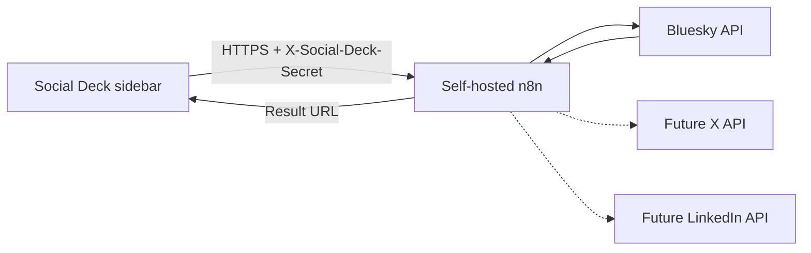

# Codex project hand-off

Last updated: 23 July 2026  
Repository: `torin-cyber-group/obsidian-social-deck`  
Current plugin version: `0.1.0`

## Project purpose

Social Deck is an Obsidian plugin for composing pasted social posts in a sidebar
and publishing them to selected platforms through a self-hosted n8n instance.

The intended experience is similar to a small social-media deck inside Obsidian:

- The sidebar is the compose surface.
- Users paste text directly into the sidebar composer.
- Platform enablement lives in plugin settings.
- Platform character limits are checked before publishing.
- n8n holds social-platform credentials and performs external API calls.
- Successful posts show in-Obsidian feedback with the public URL.

The planned platforms are Bluesky, X and LinkedIn. Only text-only Bluesky publishing is currently implemented.

## Decisions already made

- Keep social-platform credentials out of Obsidian and the vault.
- Store social-platform credentials in n8n credentials.
- Store only the n8n webhook URL and selected SecretStorage ID in plugin settings.
- Store the n8n webhook secret value through Obsidian SecretStorage.
- Use a custom raven icon for the Obsidian ribbon and Social Deck view.
- Treat n8n as the publication boundary. It will eventually own scheduling, retries and platform-specific API handling.
- Start with direct, text-only Bluesky publishing before adding images, threads, scheduling or other platforms.
- Defer X integration until an acceptable API-access option is chosen.

## What works now

### Obsidian plugin

- Opens Social Deck from the raven ribbon icon or the **Open Social Deck** command.
- Provides a sidebar composer for pasted text.
- Displays platform enablement controls in settings.
- Keeps the current draft in memory.
- Shows a live Bluesky character count.
- Flags previews that exceed their platform limit.
- Publishes eligible Bluesky text to the configured n8n webhook.
- Shows successful Bluesky feedback in Obsidian with a view link and copy button.
- Creates Bluesky URL link facets for `http://` and `https://` URLs.

### n8n workflow

`n8n/workflows/social-deck-router.json` is the recommended public webhook
workflow. It:

- Accepts an `X-Social-Deck-Secret` authenticated request from Social Deck.
- Handles connection-test requests directly.
- Routes Bluesky payloads to `n8n/workflows/bluesky-publisher-subworkflow.json`
  through n8n's Execute Sub-workflow node.

`n8n/workflows/bluesky-publisher-subworkflow.json` owns Bluesky credentials,
creates a Bluesky session, creates text posts with URL link facets and returns
the AT Protocol URI, CID and public Bluesky URL to the router.

`n8n/workflows/social-post-publisher.json` remains as a multi-platform scaffold,
but it should not be the workflow activated for current Bluesky-only publishing.
Future X and LinkedIn support should move to separate platform workflows rather
than reusing one large all-in-one workflow.

The workflow expects a dedicated Bluesky app password. It does not require a developer API key or client secret.

### Build and distribution

- `npm run build` type-checks the TypeScript and builds `main.js`.
- GitHub Actions builds every push and pull request targeting `main`.
- Successful `main` builds produce a downloadable `social-deck.zip` artifact.
- Tags matching `v*` create a GitHub release containing the ZIP.

## What does not work yet

- X publishing
- LinkedIn publishing
- Scheduling
- Retry queues or delivery history
- Image or video uploads
- Link preview cards
- Bluesky threads
- X threads
- Multi-account credential selection in n8n
- OAuth-based multi-user Bluesky authentication
- Automated tests
- Obsidian Community Plugins release packaging

The X and LinkedIn cards are previews only. Their `supportsImages` and `supportsThreads` values describe intended platform capabilities, not implemented Social Deck features.

## Architecture and trust boundary



Platform passwords and tokens belong in n8n. They must not be added to:

- Markdown notes
- Plugin settings
- Workflow JSON committed to Git
- Screenshots, issues or test fixtures

The plugin stores the n8n webhook URL and selected SecretStorage ID in Obsidian plugin data. The n8n webhook secret value belongs in Obsidian SecretStorage and is retrieved only when publishing.

## Important files

| Path | Purpose |
|---|---|
| `src/main.ts` | Plugin lifecycle, view registration and Bluesky publishing |
| `src/views/social-deck-view.ts` | Sidebar composer, publish button and publish feedback |
| `src/services/publish-service.ts` | Authenticated request to the n8n webhook and response validation |
| `src/platforms/definitions.ts` | Platform names, limits and intended capabilities |
| `src/settings.ts` | n8n webhook URL, SecretStorage selector, platform enablement and default display label |
| `src/icons.ts` | Custom raven SVG registered with Obsidian |
| `src/types/social.ts` | Shared platform and metadata types |
| `n8n/workflows/social-deck-router.json` | Recommended public webhook router workflow |
| `n8n/workflows/bluesky-publisher-subworkflow.json` | Recommended Bluesky publisher sub-workflow |
| `n8n/workflows/bluesky-post-publisher.json` | Direct Bluesky publishing fallback workflow |
| `n8n/workflows/social-post-publisher.json` | Multi-platform scaffold for future platform work |
| `n8n/README.md` | n8n credentials, webhook authentication and setup instructions |
| `.github/workflows/build.yml` | Build artifact and tagged-release workflow |
| `SECURITY.md` | Credential boundary and vulnerability reporting guidance |

## Local development

Requirements:

- Node.js 20 or newer
- npm
- Obsidian 1.11.4 or newer

Install dependencies and build:

```bash
npm install
npm run build
```

For manual testing, copy or link these files into the test vault:

```text
main.js
manifest.json
styles.css
```

Destination:

```text
<vault>/.obsidian/plugins/social-deck/
```

Reload Obsidian and enable **Social Deck** under Community plugins.

## Bluesky development setup

1. Create a dedicated Bluesky app password at <https://bsky.app/settings/app-passwords>.
2. Create the `Bluesky app password` HTTP Request custom-auth credential in n8n.
3. Import `n8n/workflows/bluesky-publisher-subworkflow.json`.
4. Configure its `Bluesky app password` credential.
5. Import `n8n/workflows/social-deck-router.json`.
6. Set **Call Bluesky workflow** to the imported Bluesky sub-workflow ID.
7. Configure the router workflow's Header Auth credential as described in
   `n8n/README.md`.
8. Activate the router workflow.
6. Copy its production webhook URL into Social Deck settings.
7. Create or select an Obsidian SecretStorage entry containing the matching webhook secret.
8. Test with pasted Bluesky text no longer than 300 characters.

Never commit real handles, app passwords, webhook URLs or webhook secrets.

## Recommended next work

Work in small, independently testable increments.

1. **Improve Bluesky failure handling**
   - Prevent accidental duplicate publication caused by repeated clicks or ambiguous timeouts.
   - Add clearer n8n response validation and user-facing error messages.

2. **Add automated tests**
   - Test Unicode character counting and publish-response validation.
   - Test missing webhook URL and SecretStorage configuration.

3. **Add Bluesky images**
   - Send file data to n8n without exposing arbitrary vault paths.
   - Upload blobs through Bluesky before creating the post record.
   - Enforce media type, size and alt-text requirements.

4. **Add Bluesky threads**
   - Define an explicit thread format in the sidebar composer.
   - Publish replies sequentially and retain every resulting URL.
   - Decide how partial thread failures are represented.

5. **Add scheduling**
   - Add a sidebar scheduled-time control with time zone handling.
   - Queue posts in n8n rather than relying on Obsidian being open.

6. **Assess LinkedIn integration**
   - Confirm whether personal profiles, organisation pages or both are required first.
   - Document the required LinkedIn application permissions and review requirements.
   - Keep LinkedIn access and refresh tokens in n8n.

7. **Reassess X integration**
   - Confirm the current API tier, posting limits and cost before implementation.
   - Keep X disabled by default until credentials and an n8n workflow are configured.

## Constraints for future Codex sessions

- Inspect the current repository before changing anything; this document may lag behind the code.
- Preserve the credential boundary between Obsidian and n8n.
- Do not add secrets, production URLs or real account identifiers to commits.
- Keep platform integrations isolated so Bluesky changes do not require X or LinkedIn credentials.
- Use Obsidian APIs rather than Node-only filesystem calls because `manifest.json` currently declares `isDesktopOnly: false`.
- Keep changes compatible with the minimum Obsidian version in `manifest.json`.
- Run `npm run build` after TypeScript changes.
- Update this document and the relevant setup guide whenever behaviour or configuration changes.
- Keep Australian English in user-facing text and documentation.

## Prompt for a new Codex session

Use this when starting work in another Codex session:

> Continue development of `torin-cyber-group/obsidian-social-deck`. Read `README.md`, `SECURITY.md`, `n8n/README.md` and `docs/CODEX_HANDOFF.md`, then inspect the current code and Git history before making changes. Bluesky text publishing works through an authenticated n8n webhook; X and LinkedIn are preview-only. Preserve the existing credential boundary and do not commit secrets. Confirm the next feature and its acceptance criteria with me before implementation.
